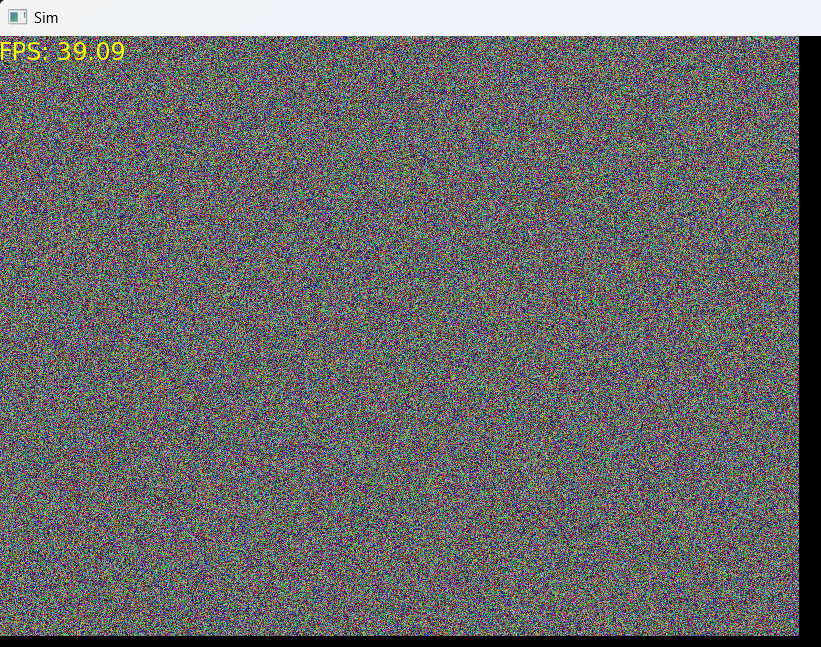
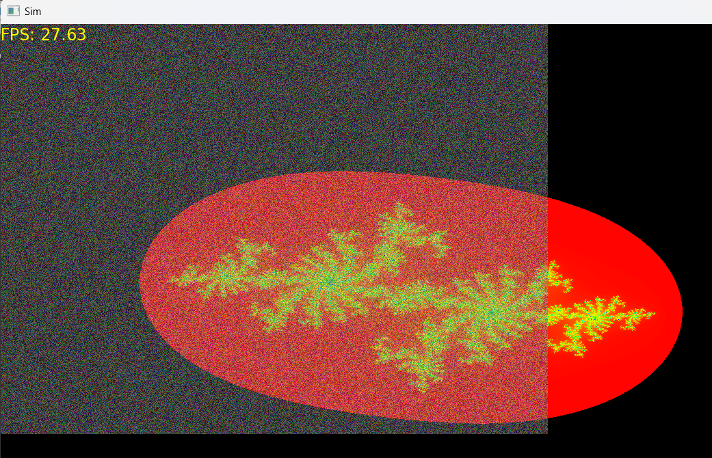
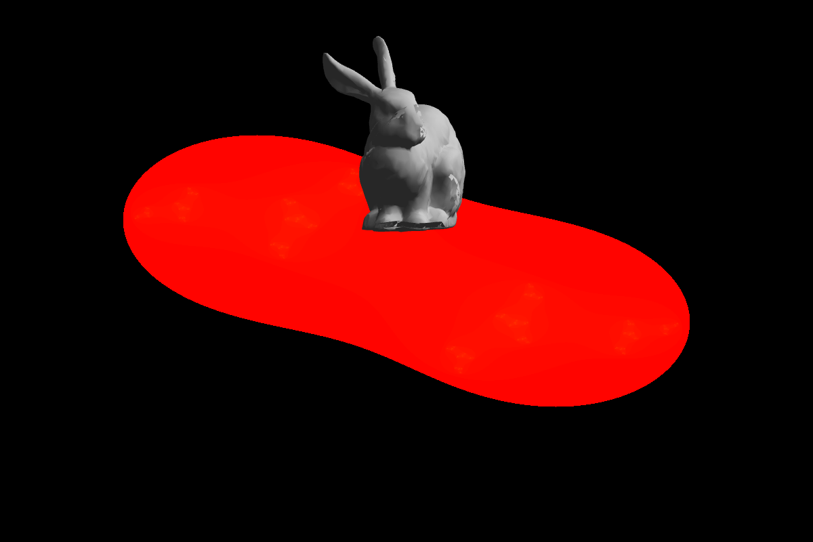
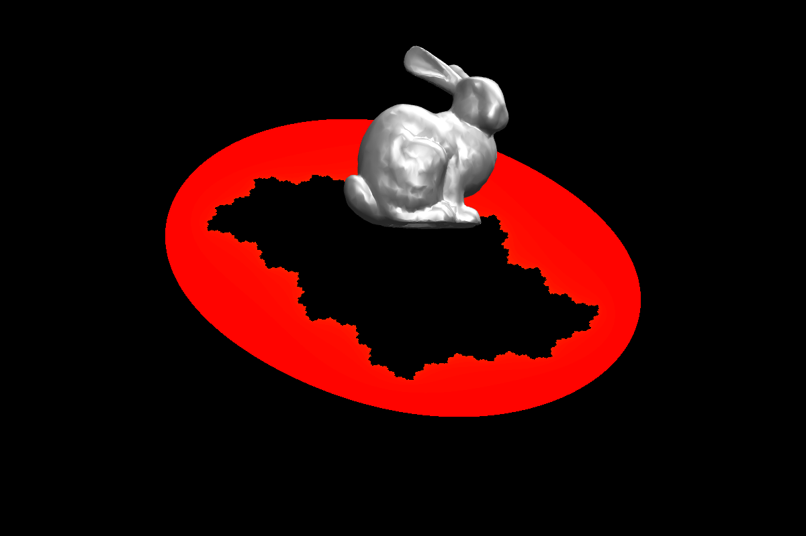
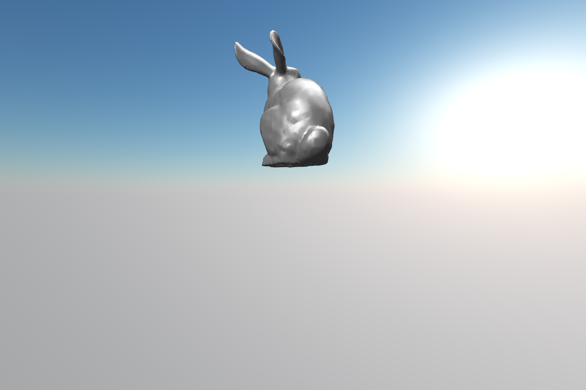

# Fractal
New simulation software

## Devlog
- 10-15-2023: Components pulled over from other C++ projects, refined along the way

- 10-22-2023: Integrate SFML and OpenGL to render simultaneously

- 11-02-2023: Integrate mesh rendering

- 11-04-2023: Fix see-through rendering bug

- 11-05-2023: Pull in external sky shader for atmospheric rendering

# Fractal-old
Contains the skeleton for a new fractal-based game idea.
